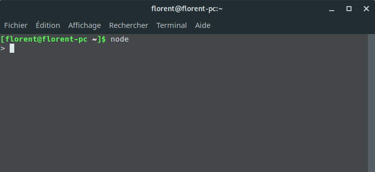
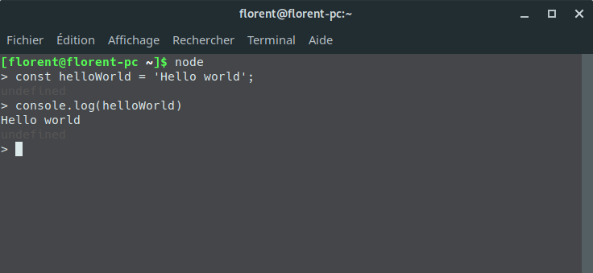
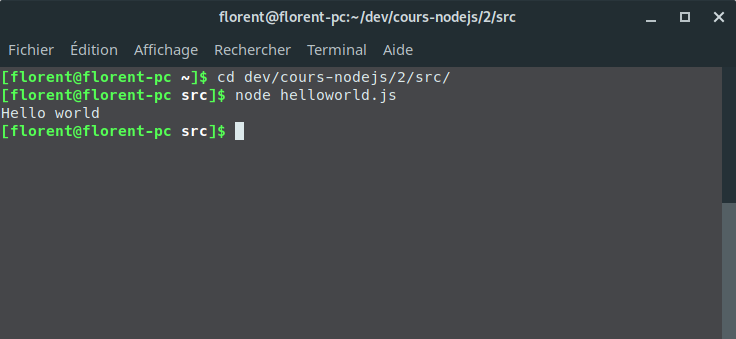
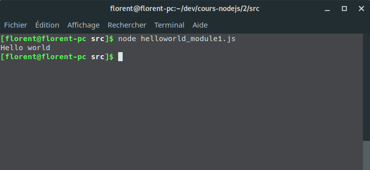
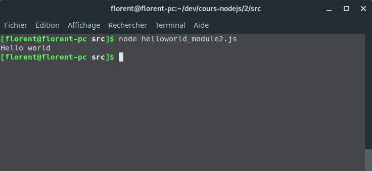

Cours 2

# Place à la manipulation !

Aller, maintenant on va manipuler node.js avec les bases qu'on a vues au cours précédent.

## Hello world

Ouais, c'est sérieux. On va faire des hello world.

### Avec node directement

Lancez node la console:

> les manières de laner node diffèrent selon les systemes d'exploitation.



A partir de là, nous somme dans la console node. On va pouvoir executer les requetes que l'on désire. Et comme ce que je désire le plus au monde, c'est qu'on me dise hello world, on va demander à nodejs de nous écrire un magnifique `Hello world`.

Je te propose le code suivant. Mais libre à toi de lui demander de la manière que tu veux.

```js
const helloWorld = 'Hello world';
console.log(helloWorld);
```



Bravo. C'est incroyable, tu arrives à donner des instructions à node à partir de la console.
Et comme je sais que tu es un énorme amateur de Hello world, tu vas me dire que c'est pas très pratique d'écrire tout ça à chaque vois que tu en veux un.

Et bien tes voeux vont être récompensés, on va faire un script.

### Avec un script

Pour executer un script js avec node, c'est très simple. Il faut écrire `node /chemin/vers/ton/script.js`.

Tu peux ouvrir [ton éditeur de texte préféré](https://code.visualstudio.com/) et créer un nouveau fichier avec ce que tu viens d'écrire, ou aller dans le dossier [src](./src) du cours 2 et executer `helloworld.js`.



On a vu comment créer et executer un script simple à partir d'un fichier. Mais comment faire pour utiliser des librairies externes dans notre script node ?

## Les modules node

### Pourquoi ?

La puissance de nodejs et du javascript actuel réside dans ses librairies (qu'on appelle modules) mises à disposition par la communauté. Alors on va nous aussi apprendre à écrire un module.

Un module, c'est une sorte de script, dont on exporte certaines parties, qui seront utiles dans un scope différent que celui dans lequel on est.

Dans notre cas, nous allons exporter une fonction `affiche` dont l'unique job sera d'afficher ce qu'on lui passera en paramètre.

Encore une fois, la synthèse de ce que j'écris ici se trouve dans le dossier [src](./src).

### Comment ?

On va créer un nouveau fichier `affiche.js` dans lequel on va écrire notre fonction affiche :

```javascript
// affiche.js
const affiche = texte => console.log(texte);
```

Puis il va falloir "exposer" cette fonction pour la rendre "importable".

```javascript
// [...]
module.exports = affiche;
```

`module.exports` represente la variable qui sera importable. Dans notre cas, on affecte à cette variable la fonction `affiche`. Nous aurions très bien pu exporter de la donnée, une constante etc...

Nous allons donc pouvoir créer un nouveau fichier qu'on nommera `helloworld_module1.js`, dans lequel on importera ce nouveau module, qu'on executera ensuite.

```javascript
// helloworld_module1.js
const affiche = require('./affiche'); // on remarque ici qu'il n'est pas necessaire de renseigner l'extension '.js' du fichier

affiche('Hello world');
```

On execute `helloworld_module1.js`, et voilà :



### node_modules

Il existe deux manières d'importer des modules :

* Importer un fichier avec son chemin absolu ou relatif.
* Importer un nom de module directement sans avoir à se soucier du chemin

il faut savoir que la fonction `require` de nodejs var regarder par défaut, quand aucun path n'est renseigné, dans un dosser nommé `node_modules`.

Aussi si j'écris

```javascript
const affiche = require('affiche');
```

`affiche` est renseigné comme nom de module et non comme un chemin vers un fichier `.js`.

> Il faut savoir que `require`, dans le cas d'un nom de module, remonte l'arborescence du projet à la recherche du premier dossier `node_modules` qu'il trouvera qui contiendra ce module.

Pour tester ça nous pouvons créer un dossier `node_modules`, avec à l'intérieur un fichier `afficheTexte.js` qui contient exactement le même code que le fichier `affiche.js` créé précédemment.

Créons un second fichier nommé `helloworld_module2.js`; avec le code suivant ;

```javascript
const affiche = require('afficheTexte');

affiche('Hello world');
```

Et executons le :



Bravo ! Vous avez créé votre premier module !

## Amuse toi !

Tu peux maintenant t'amuser à créer différents fichiers et modules et construire un petit script !

Quand tu seras prêt, RDV au [cours 3](../3).
