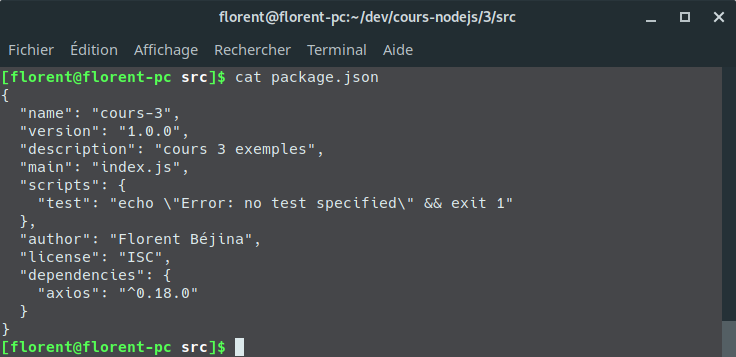
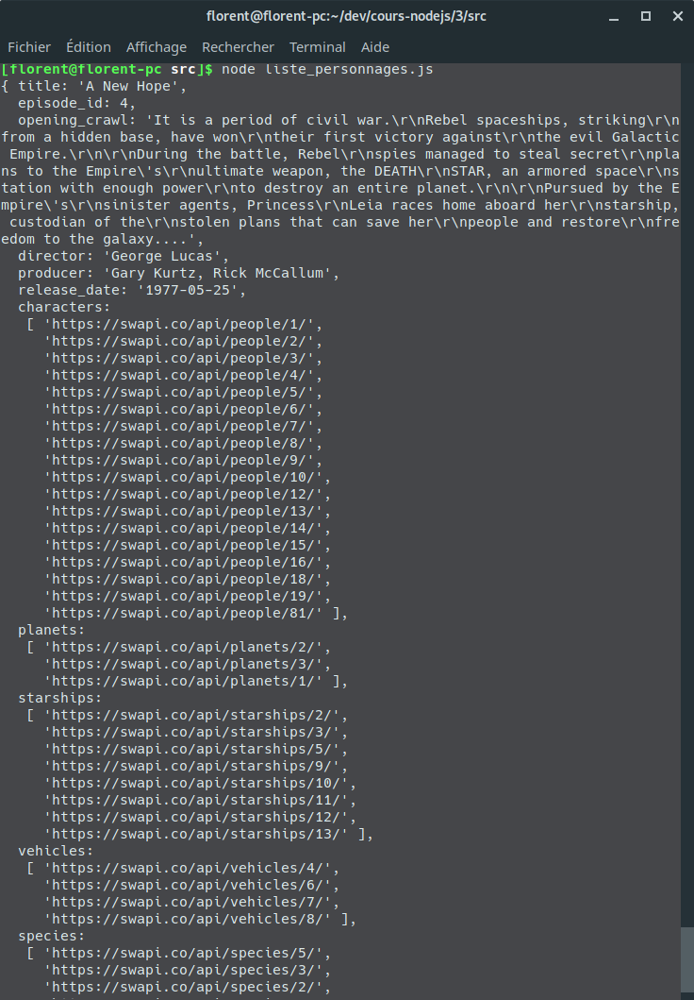

Cours 3

# Les modules NPM

La communauté javascript a la chance de bénéficier du plus gros catalogue de modules, tous languages confondus. Ce catalogue s'appelle [npm](https://npmjs.com), et tout son contenu est disponible àu téléchargement via une commande installée en même temps que node.js : `npm`.

## Les commandes de base npm

### Initialiser un projet

Pour initialiser un projet nodejs avec npm, il faut écrire `npm init`.

Une série d'information te sera demandé, comme le nom de ton projet, l'auteur ou la version.

Suite à ce petit process, tu verras un nouveau fichier apparaitre nommé `package.json`, qui recense toutes les informations importantes sur ton projet, comme :

- la liste des packages installés,
- la liste des commandes pour lancer ton programme

### Installer un module

Pour installer un module il faut écrire `npm install <nom du module>`.

`npm install` peut s'accompagner de certaines options comme les suivantes :

- `--save` : sauvegarde l'information en notant dans le fichier `package.json` quel module tu as installé et à quelle version "à peu pres"
- `--save-dev` : pareil que `--save` mais place le nom du module dans une seconde liste, pour les process de developement
- `--exact` : sauvegarde la version exacte installée
- `-g` : permet d'installer un packae node de manière globale et pas uniquement lié à ton projet

#### Information

Chaque module installé par cette commande sera placé dane le fammeux dossier [node_modules](../2/README.md#node_modules). Il pourra donc être importé dans ton projet de la manière suivante :

```javascript
const monModule = require('mon-mondule');
```

### Supprimer un module

Pour installer un module il faut écrire `npm remove <nom du module>`.

`npm remove` peut s'accompagner de certaines options comme celle-ci :

- `--save` : permet de retirer du fichier le nom du module

### Installer une liste de modules depuis le fichier de sauvegarde

Si tu possèdes un fichier `package.json`, avec une liste de dépendences (`dependencies`) à l'intérieur



Tu peux simplement faire `npm install`.

## Cas pratique, importer et manipuler un module npm

Dans le fichier `package.json`, tu peux voir que j'ai déjà renseigné le module `axios`. Cette librairie va te servir à faire des requêtes http simplement.
Tu peux trouver la documentation d'axios [sur sa page github](https://github.com/axios/axios).

### Problématique

Disons que tu es un tres grand <strike>geek</strike> fan  de Star Wars, et que t'as envie d'en savoir un peu plus sur tes personnages préférés. Tu sais justement qu'il existe une API ([SWAPI](https://swapi.co/)) pour ça !

Tu souhaites donc te lancer dans la création d'un petit script qui te listera les données des personnages.

Tu eux donc faire une requete http avec javascript, et t'en a aucune foutre idée de comment executer ce tour de magie.

### Recherche et installation

Utiliser un package de quelqu'un d'autre s'apparente toujours à la même chose. Tu feras quasiment toujours les mêmes actions :

1. Tu vas rechercher sur Google si un module n'existe pas déjà. Bingo ! Ça existe et ça s'appelle `axios` (il en existe d'autres mais axios est celui que j'utilise tout le temps alors voilà :D)
2. Tu vas aller voir [sur npm](https://www.npmjs.com/package/axios) si le module est bien maintenu ou s'il est bien utilisé (une grosse communauté d'utilisateur implique en général un module robuste et utile). Au moment où j'écris ces lignes, le module a plus de 3.1 millions de téléchargements hebdomadaires (ce qui est énorme) et la dernière version du module a été publiée il y a 2 mois (donc le module est maintenu).
3. Tu vas aller lire la documentation pour voir si tu peux arriver à le manipuler facilement.
4. Tu vas l'installer avec `npm install --save axios`.

### Importation dans ton projet

Tu vas donc créer un fichier `liste_personnages.js` dans lequel tu vas commencer par importer le module :

```javascript
const axios = require('axios');
```

Selon la documentation d'axios, tu fois que tu peux faire des requetes en `GET` simplement avec la syntaxe suivante `axios.get(url)`, et que axios retourne une promesse. Tu auras donc accès à la donnée dans le `.then()`.

```javascript
// https://swapi.co/
axios.get('https://swapi.co/api/films/1')
  .then(result => console.log(result));
```

Tu remarque que ta console affiche l'ensemble de la réponse http du serveur, et c'est long, imbuvable, et inutile

<details><summary>Resutlat</summary>
<p>

```{ status: 200,
  statusText: 'OK',
  headers:
   { date: 'Sat, 20 Oct 2018 11:03:12 GMT',
     'content-type': 'application/json',
     'transfer-encoding': 'chunked',
     connection: 'close',
     'set-cookie':
      [ '__cfduid=d2fbf1615d134b98979108788091dc0bc1540033391; expires=Sun, 20-Oct-19 11:03:11 GMT; path=/; domain=.swapi.co; HttpOnly; Secure' ],
     vary: 'Accept, Cookie',
     allow: 'GET, HEAD, OPTIONS',
     'x-frame-options': 'SAMEORIGIN',
     etag: '"145c70f4eca80b4752674d42e5bf1bcf"',
     via: '1.1 vegur',
     'expect-ct': 'max-age=604800, report-uri="https://report-uri.cloudflare.com/cdn-cgi/beacon/expect-ct"',
     server: 'cloudflare',
     'cf-ray': '46caff1abb14bd6a-CDG' },
  config:
   { adapter: [Function: httpAdapter],
     transformRequest: { '0': [Function: transformRequest] },
     transformResponse: { '0': [Function: transformResponse] },
     timeout: 0,
     xsrfCookieName: 'XSRF-TOKEN',
     xsrfHeaderName: 'X-XSRF-TOKEN',
     maxContentLength: -1,
     validateStatus: [Function: validateStatus],
     headers:
      { Accept: 'application/json, text/plain, */*',
        'User-Agent': 'axios/0.18.0' },
     method: 'get',
     url: 'https://swapi.co/api/people/1',
     data: undefined },
  request:
   ClientRequest {
     domain: null,
     _events:
      { socket: [Function],
        abort: [Function],
        aborted: [Function],
        error: [Function],
        timeout: [Function],
        prefinish: [Function: requestOnPrefinish] },
     _eventsCount: 6,
     _maxListeners: undefined,
     output: [],
     outputEncodings: [],
     outputCallbacks: [],
     outputSize: 0,
     writable: true,
     _last: true,
     upgrading: false,
     chunkedEncoding: false,
     shouldKeepAlive: false,
     useChunkedEncodingByDefault: false,
     sendDate: false,
     _removedConnection: false,
     _removedContLen: false,
     _removedTE: false,
     _contentLength: 0,
     _hasBody: true,
     _trailer: '',
     finished: true,
     _headerSent: true,
     socket:
      TLSSocket {
        _tlsOptions: [Object],
        _secureEstablished: true,
        _securePending: false,
        _newSessionPending: false,
        _controlReleased: true,
        _SNICallback: null,
        servername: 'swapi.co',
        npnProtocol: false,
        alpnProtocol: false,
        authorized: true,
        authorizationError: null,
        encrypted: true,
        _events: [Object],
        _eventsCount: 9,
        connecting: false,
        _hadError: false,
        _handle: [Object],
        _parent: null,
        _host: 'swapi.co',
        _readableState: [Object],
        readable: true,
        domain: null,
        _maxListeners: undefined,
        _writableState: [Object],
        writable: false,
        allowHalfOpen: false,
        _bytesDispatched: 135,
        _sockname: null,
        _pendingData: null,
        _pendingEncoding: '',
        server: undefined,
        _server: null,
        ssl: [Object],
        _requestCert: true,
        _rejectUnauthorized: true,
        parser: null,
        _httpMessage: [Circular],
        [Symbol(asyncId)]: 19,
        [Symbol(bytesRead)]: 0 },
     connection:
      TLSSocket {
        _tlsOptions: [Object],
        _secureEstablished: true,
        _securePending: false,
        _newSessionPending: false,
        _controlReleased: true,
        _SNICallback: null,
        servername: 'swapi.co',
        npnProtocol: false,
        alpnProtocol: false,
        authorized: true,
        authorizationError: null,
        encrypted: true,
        _events: [Object],
        _eventsCount: 9,
        connecting: false,
        _hadError: false,
        _handle: [Object],
        _parent: null,
        _host: 'swapi.co',
        _readableState: [Object],
        readable: true,
        domain: null,
        _maxListeners: undefined,
        _writableState: [Object],
        writable: false,
        allowHalfOpen: false,
        _bytesDispatched: 135,
        _sockname: null,
        _pendingData: null,
        _pendingEncoding: '',
        server: undefined,
        _server: null,
        ssl: [Object],
        _requestCert: true,
        _rejectUnauthorized: true,
        parser: null,
        _httpMessage: [Circular],
        [Symbol(asyncId)]: 19,
        [Symbol(bytesRead)]: 0 },
     _header: 'GET /api/people/1/ HTTP/1.1\r\nAccept: application/json, text/plain, */*\r\nUser-Agent: axios/0.18.0\r\nHost: swapi.co\r\nConnection: close\r\n\r\n',
     _onPendingData: [Function: noopPendingOutput],
     agent:
      Agent {
        domain: null,
        _events: [Object],
        _eventsCount: 1,
        _maxListeners: undefined,
        defaultPort: 443,
        protocol: 'https:',
        options: [Object],
        requests: {},
        sockets: [Object],
        freeSockets: {},
        keepAliveMsecs: 1000,
        keepAlive: false,
        maxSockets: Infinity,
        maxFreeSockets: 256,
        maxCachedSessions: 100,
        _sessionCache: [Object] },
     socketPath: undefined,
     timeout: undefined,
     method: 'GET',
     path: '/api/people/1/',
     _ended: true,
     res:
      IncomingMessage {
        _readableState: [Object],
        readable: false,
        domain: null,
        _events: [Object],
        _eventsCount: 3,
        _maxListeners: undefined,
        socket: [Object],
        connection: [Object],
        httpVersionMajor: 1,
        httpVersionMinor: 1,
        httpVersion: '1.1',
        complete: true,
        headers: [Object],
        rawHeaders: [Array],
        trailers: {},
        rawTrailers: [],
        upgrade: false,
        url: '',
        method: null,
        statusCode: 200,
        statusMessage: 'OK',
        client: [Object],
        _consuming: true,
        _dumped: false,
        req: [Circular],
        responseUrl: 'https://swapi.co/api/people/1/',
        redirects: [],
        read: [Function] },
     aborted: undefined,
     timeoutCb: null,
     upgradeOrConnect: false,
     parser: null,
     maxHeadersCount: null,
     _redirectable:
      Writable {
        _writableState: [Object],
        writable: true,
        domain: null,
        _events: [Object],
        _eventsCount: 2,
        _maxListeners: undefined,
        _options: [Object],
        _redirectCount: 1,
        _redirects: [],
        _requestBodyLength: 0,
        _requestBodyBuffers: [],
        _onNativeResponse: [Function],
        _currentRequest: [Circular],
        _currentUrl: 'https://swapi.co/api/people/1/',
        _isRedirect: true },
     [Symbol(outHeadersKey)]: { accept: [Array], 'user-agent': [Array], host: [Array] } },
  data:
   { name: 'Luke Skywalker',
     height: '172',
     mass: '77',
     hair_color: 'blond',
     skin_color: 'fair',
     eye_color: 'blue',
     birth_year: '19BBY',
     gender: 'male',
     homeworld: 'https://swapi.co/api/planets/1/',
     films:
      [ 'https://swapi.co/api/films/2/',
        'https://swapi.co/api/films/6/',
        'https://swapi.co/api/films/3/',
        'https://swapi.co/api/films/1/',
        'https://swapi.co/api/films/7/' ],
     species: [ 'https://swapi.co/api/species/1/' ],
     vehicles:
      [ 'https://swapi.co/api/vehicles/14/',
        'https://swapi.co/api/vehicles/30/' ],
     starships:
      [ 'https://swapi.co/api/starships/12/',
        'https://swapi.co/api/starships/22/' ],
     created: '2014-12-09T13:50:51.644000Z',
     edited: '2014-12-20T21:17:56.891000Z',
     url: 'https://swapi.co/api/people/1/' } }
```

</p>
</details>

Ce qui nous interesse, c'est uniquement l'objet `data`. On va donc utiliser la deconstruction pour afficher cette donnée.

```javascript
// https://swapi.co/
axios.get('https://swapi.co/api/films/1')
  .then(({ data }) => console.log(data));
```

Et voilà ! :



Ce qui nous interesse ici dans ces données, ce sont les personnages. On va donc récupérer les urls en écrivant :

```javascript
// méthode 1 : chainer les then
axios.get('https://swapi.co/api/films/1')
  .then(({ data }) => data) // le then suivant prend la valeur de retour du then précédent.
  .then(({ characters }) => console.log(characters)); // dans ce cas,
  // then a comme premier argument la valeur de data du then précédent


// méthode 2 : la déconstruction profonde
// ATTENTION WTF INCOMING
axios.get('https://swapi.co/api/films/1')
  .then(({ data: { characters }}) => console.log(characters))
```

Maintenant on a un tableau d'URLS.

On veut pour chaque item, récupérer le nom du personnage. Pour ça on va utiliser la [methode `forEach`](https://developer.mozilla.org/fr/docs/Web/JavaScript/Reference/Objets_globaux/Array/forEach) de `Array`, et pour chaque url, refaire un `axios.get`, et pour chaque résultat, extraire le nom et l'afficher.

```javascript
axios.get('https://swapi.co/api/films/1')
  .then(({ data: { characters } }) => {
    characters.forEach(url => {
      axios.get(url)
        .then(({ data: { name } }) => console.log(name))
    })
  })

```

Et voilà !

## A toi de jouer

Maintenant tu peux construire des scripts beaucoup plus puissants en piochant dans les modules disponibles sur npm !


Quand tu seras prêt, RDV au [cours 4](../4).
